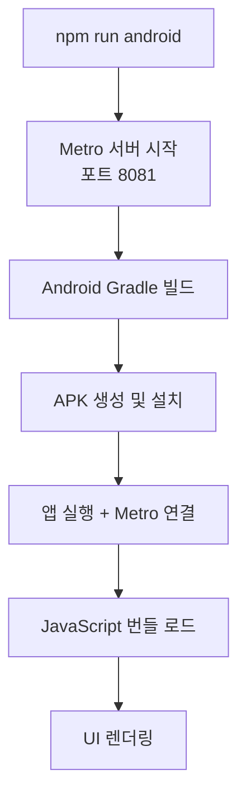

# React Native Android 실행 완전 가이드

## 📚 사전 용어 설명

### Frontend 관련 도구들 (Java 백엔드와 비교)

| Frontend 도구 | Java 백엔드 유사 도구 | 설명 |
|--------------|-------------------|------|
| **npm** | Maven/Gradle | 패키지 매니저. Maven처럼 의존성을 관리하고 빌드 스크립트를 실행 |
| **package.json** | pom.xml/build.gradle | 프로젝트 설정 파일. 의존성, 스크립트, 메타데이터 정의 |
| **package-lock.json** | Maven의 .m2 캐시 | 정확한 의존성 버전을 고정. 재현 가능한 빌드 보장 |
| **npx** | mvn exec / gradle run | 패키지를 임시로 다운로드해서 실행 |
| **Metro** | Spring Boot DevTools | JavaScript 번들러이자 개발 서버. 핫 리로드 제공 |

### 핵심 개념 상세 설명

#### 1. **npm** (Node Package Manager)
```bash
# Java Maven과 비교
npm install axios        # mvn dependency:get과 유사
npm run android         # mvn spring-boot:run과 유사
npm start              # 개발 서버 시작 (mvn spring-boot:run)
```

#### 2. **package.json** 
Maven의 `pom.xml`과 동일한 역할:
```json
{
  "name": "crewbe-interview-android",     // Maven의 artifactId
  "version": "1.0.0",                    // Maven의 version
  "dependencies": {                      // Maven의 <dependencies>
    "react": "18.2.0",
    "react-native": "0.73.6"
  },
  "scripts": {                          // Maven의 plugins/goals
    "android": "react-native run-android"
  }
}
```

#### 3. **Metro**
- **Java 유사 도구**: Spring Boot DevTools + Webpack
- **역할**: 
  - JavaScript/TypeScript 파일들을 하나의 번들로 합침
  - 개발 서버 실행 (포트 8081)
  - Hot Reload 기능 제공
  - Java로 비유하면 "실시간 컴파일 + 자동 재시작"

#### 4. **android 폴더**
- **Java 유사**: 순수 Android Studio 프로젝트
- **역할**: 
  - React Native JavaScript를 실행할 네이티브 Android 앱
  - Java의 War 파일을 실행할 Tomcat 서버와 유사
  - `gradle` 빌드 시스템 사용 (Java 백엔드와 동일!)

---

## 🚀 React Native Android 실행을 위한 Step-by-Step 과정

### Phase 1: 프로젝트 구조 이해 및 정리

#### Step 1: Expo → React Native CLI 전환
**문제상황**: Expo 기반 프로젝트였지만 네이티브 모듈 접근이 제한됨

**해결과정**:
```bash
# Java Spring Boot Starter → 순수 Spring Boot 전환과 유사
# Expo의 추상화 레이어 제거하고 직접 제어
```

**Java 비유**: 
- Expo = Spring Boot Starter (편리하지만 제약)
- React Native CLI = 순수 Spring Boot (복잡하지만 자유도 높음)

#### Step 2: package.json 의존성 정리
**Before (복잡한 의존성)**:
```json
{
  "dependencies": {
    "@expo/vector-icons": "^13.0.0",
    "expo": "~49.0.0",
    "expo-camera": "~13.4.4",
    "@react-navigation/native": "6.0.13",
    // ... 많은 라이브러리들
  }
}
```

**After (최소 의존성)**:
```json
{
  "dependencies": {
    "react": "18.2.0",
    "react-native": "0.73.6"
  }
}
```

**Java 비유**: 
- Spring Boot 프로젝트에서 불필요한 starter 의존성들을 제거
- 핵심 Spring Core만 남기는 것과 동일

### Phase 2: 빌드 시스템 설정

#### Step 3: Gradle 버전 호환성 맞추기
**문제**: React Native 0.73.6과 Gradle 8.13 호환성 문제

**해결**:
```properties
# gradle-wrapper.properties
distributionUrl=https://services.gradle.org/distributions/gradle-8.3-bin.zip
```

**Java 비유**: 
- Spring Boot 2.7과 Java 17 호환성 문제와 동일
- 적절한 버전 매트릭스 찾아야 함

#### Step 4: Android Gradle Plugin 설정
```gradle
// android/build.gradle
buildscript {
    dependencies {
        classpath("com.android.tools.build:gradle:8.1.1")
        classpath("com.facebook.react:react-native-gradle-plugin")
    }
}
```

**Java 비유**: 
- Maven Compiler Plugin 버전 설정과 동일
- 빌드 도구 체인의 호환성 확보

### Phase 3: 네이티브 코드 수정

#### Step 5: MainApplication.kt 수정
**문제**: SoLoader 초기화 오류
```kotlin
// Before
SoLoader.init(this, OpenSourceMergedSoMapping)  // 오류

// After  
SoLoader.init(this, false)  // 정상
```

**Java 비유**:
- Spring Boot의 @EnableAutoConfiguration 설정 오류와 유사
- 자동 설정 대신 수동 설정으로 변경

#### Step 6: build.gradle 네이티브 모듈 연결
```gradle
// React Native 라이브러리들을 Android 프로젝트에 연결
apply from: file("../../node_modules/@react-native-community/cli-platform-android/native_modules.gradle")
applyNativeModulesAppBuildGradle(project)
```

**Java 비유**:
- Maven 멀티 모듈 프로젝트에서 모듈 간 의존성 설정
- parent-child 관계 정의

### Phase 4: 개발 서버 설정

#### Step 7: Metro 설정 최적화
```javascript
// metro.config.js - React Native의 Webpack
const {getDefaultConfig} = require('@react-native/metro-config');
module.exports = getDefaultConfig(__dirname);
```

**Java 비유**:
- Spring Boot의 application.yml 설정
- 개발 환경 최적화

#### Step 8: Babel 설정 (JavaScript 컴파일러)
```javascript
// babel.config.js - Java의 javac 컴파일러 설정과 유사
module.exports = {
  presets: ['module:metro-react-native-babel-preset'],
};
```

**Java 비유**:
- Maven Compiler Plugin의 source/target 버전 설정
- TypeScript → JavaScript 변환 (Java → Bytecode와 유사)

---

## 🔄 실행 흐름 (Java 백엔드와 비교)

### React Native Android 실행 과정



### Java Spring Boot 실행과 비교

| React Native | Java Spring Boot |
|-------------|------------------|
| `npm run android` | `mvn spring-boot:run` |
| Metro 서버 (8081) | Tomcat 서버 (8080) |
| JavaScript 번들링 | Java 컴파일 |
| Android APK | JAR/WAR 파일 |
| Hot Reload | DevTools 자동 재시작 |

---

## 🛠️ 주요 트러블슈팅 과정

### 1. 의존성 지옥 해결
**문제**: 버전 충돌로 인한 빌드 실패
**해결**: 최소 의존성으로 단순화

**Java 비유**: 
- Maven Dependency Hell과 동일
- BOM(Bill of Materials) 사용하거나 의존성 제외

### 2. Gradle 호환성 문제
**문제**: React Native 버전과 Gradle 버전 불일치
**해결**: 호환성 매트릭스 참조하여 다운그레이드

**Java 비유**:
- Spring Boot 버전과 Java 버전 호환성 문제
- 공식 문서의 버전 매트릭스 확인 필요

### 3. 네이티브 모듈 연결 오류
**문제**: autolinkLibrariesWithApp() 메서드 없음
**해결**: React Native 0.73.6 스타일로 수정

**Java 비유**:
- Spring Boot 2.x → 3.x 마이그레이션 시 API 변경
- 버전별 마이그레이션 가이드 참조

---

## 💡 핵심 학습 포인트

### 1. **프론트엔드도 백엔드와 동일한 개념들 사용**
- 의존성 관리 (npm ≈ Maven)
- 빌드 도구 (Metro ≈ Compiler)
- 개발 서버 (Metro ≈ DevTools)

### 2. **버전 호환성의 중요성**
- React Native 생태계는 빠르게 변화
- Java 생태계처럼 Long Term Support 개념 적용

### 3. **네이티브 브릿지 이해**
- React Native = JavaScript + 네이티브 코드
- JNI(Java Native Interface)와 유사한 개념

### 4. **개발 환경 설정의 복잡성**
- 멀티 플랫폼 개발의 어려움
- Docker를 사용한 개발 환경 표준화 고려

---

## 🎯 결론

React Native Android 개발은 **Java 백엔드 개발과 매우 유사한 패턴**을 가지고 있습니다:

1. **의존성 관리**: npm ↔ Maven
2. **빌드 시스템**: Metro ↔ Compiler  
3. **개발 서버**: Metro Server ↔ Spring Boot DevTools
4. **버전 호환성**: 동일한 문제와 해결 방식

핵심은 **각 도구의 역할을 이해하고, 버전 호환성을 맞추는 것**입니다. 